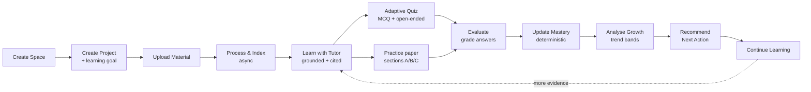
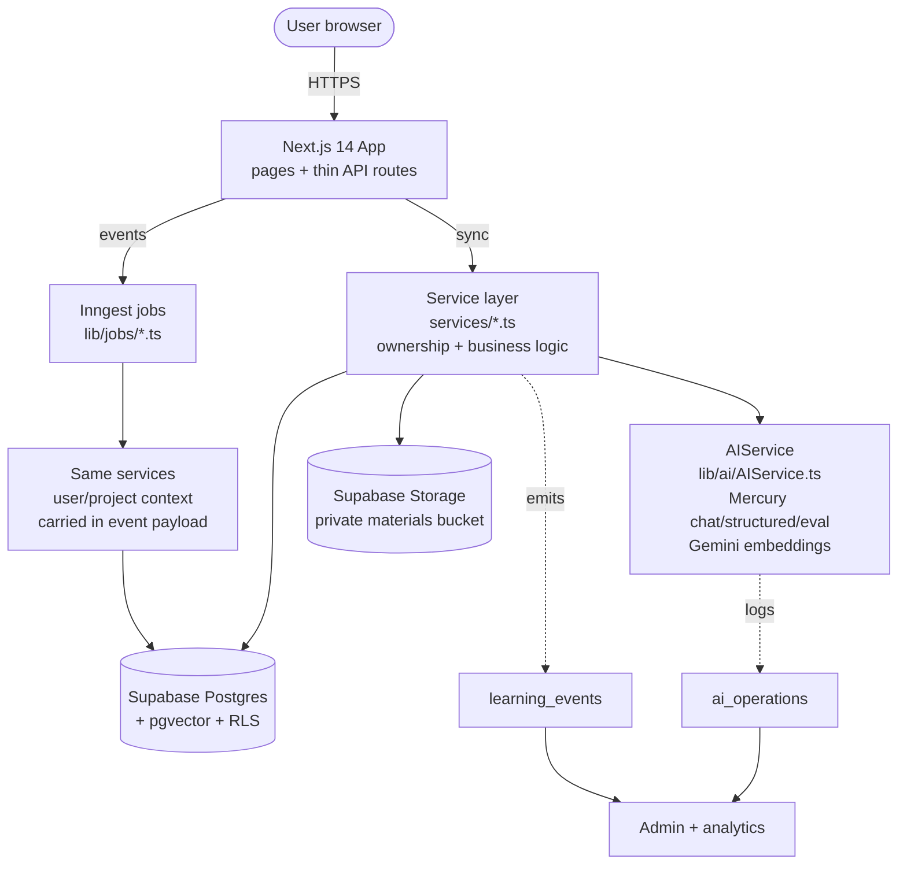
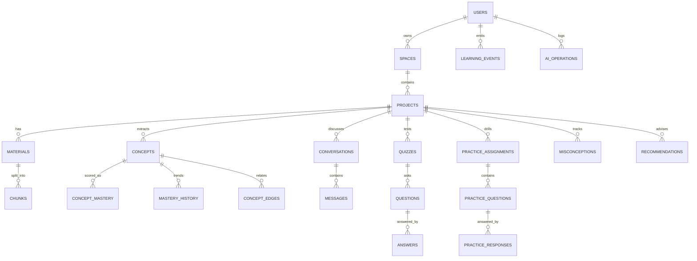
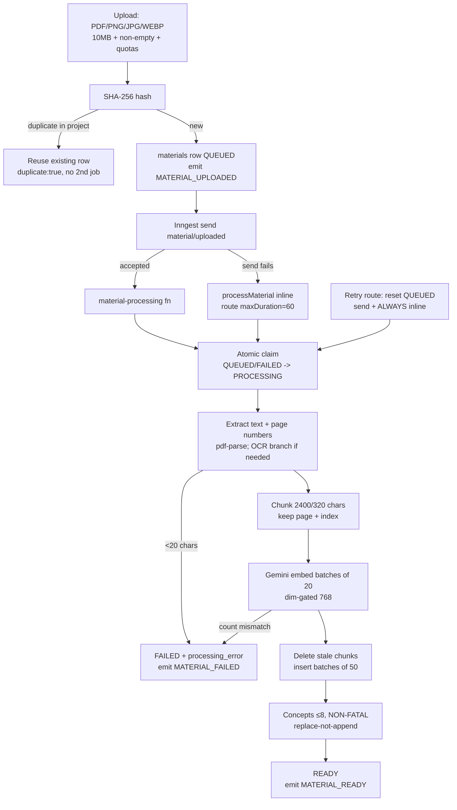
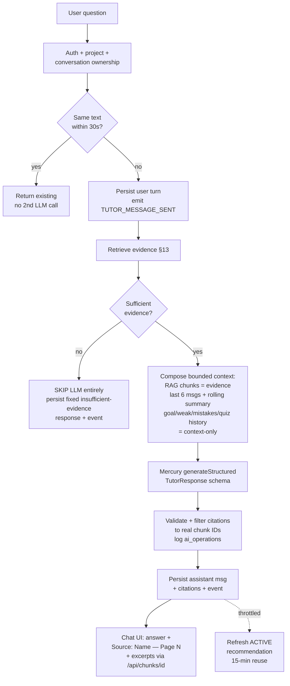
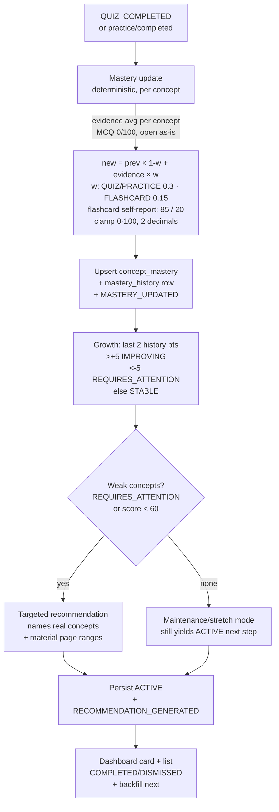
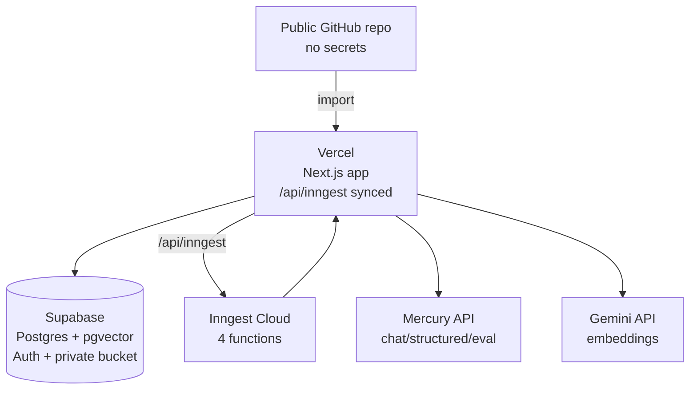

# AI Study Companion — Architecture Documentation

> **Source of truth: the current codebase.** Every claim in this document was verified against the
> implementation (services, `lib/`, `ai/`, routes, migrations, jobs, config). Where the code and
> older docs disagreed, the code won.
>
> | | |
> |---|---|
> | Product | AI-Powered Learning & Growth Workspace (PRD v3.0, Candidate Challenge Edition) |
> | Live deployment | https://ai-study-companion-three-inky.vercel.app/ |
> | Stack (actual) | Next.js 14 App Router + TypeScript · Supabase (Postgres + pgvector + Auth + Storage) · Inngest · Mercury `mercury-2.5` (chat/structured/eval) · Gemini `gemini-embedding-2` 768-d (embeddings) |
> | Current status | 314 tests across 26 files passing · 18/18 eval fixtures passing · migrations `001→014` · deployed and live |

---

## Contents

1. [Product overview and complete learning loop](#1-product-overview-and-complete-learning-loop)
2. [Technology stack and rationale](#2-technology-stack-and-rationale)
3. [High-level system architecture](#3-high-level-system-architecture)
4. [Frontend architecture](#4-frontend-architecture)
5. [Backend / API architecture](#5-backend--api-architecture)
6. [Services and responsibilities](#6-services-and-responsibilities)
7. [Database schema and relationships](#7-database-schema-and-relationships)
8. [Auth, authorization, RLS, isolation](#8-authentication-authorization-rls-and-isolation)
9. [Storage architecture](#9-storage-architecture)
10. [PDF / material processing pipeline](#10-pdf--material-processing-pipeline)
11. [OCR, image and scanned-document processing](#11-ocr-image-and-scanned-document-processing)
12. [Embedding architecture](#12-embedding-architecture)
13. [RAG / retrieval pipeline](#13-rag--retrieval-pipeline)
14. [AI Tutor: grounding, citations, unsupported questions](#14-ai-tutor-grounding-citations-and-unsupported-questions)
15. [AI / application interaction and structured outputs](#15-ai--application-interaction-and-structured-outputs)
16. [Quiz and assessment architecture](#16-quiz-and-assessment-architecture)
17. [Practice architecture](#17-practice-architecture)
18. [Concepts, subconcepts, knowledge graph, misconceptions](#18-concepts-subconcepts-knowledge-graph-and-misconceptions)
19. [Mastery, Growth and Recommendations](#19-mastery-growth-and-recommendations)
20. [Persistent learning context](#20-persistent-learning-context)
21. [Events and background workflows (Inngest)](#21-events-and-background-workflows-inngest)
22. [AI observability and evaluation](#22-ai-observability-and-evaluation)
23. [Error handling, retries, idempotency, rate limits](#23-error-handling-retries-idempotency-and-rate-limits)
24. [Security and performance](#24-security-and-performance)
25. [Admin architecture and system health](#25-admin-architecture-and-system-health)
26. [Deployment architecture and configuration](#26-deployment-architecture-and-configuration)
27. [Testing and evaluation status](#27-testing-and-evaluation-status)
28. [Trade-offs, known limitations, future improvements](#28-trade-offs-known-limitations-and-future-improvements)
29. [Exact current project status](#29-exact-current-project-status)

---

## 1. Product overview and complete learning loop

AI Study Companion is a persistent, contextual, measurable learning workspace — not a PDF chatbot.
A learner organises study into **Spaces** (broad areas) → **Projects** (focused goals with a
`learning_goal`), uploads **Materials** (PDFs and images), learns with a **grounded AI Tutor**,
is tested by an **adaptive Quiz** (MCQ + open-ended) and **Practice** papers, and the system tracks
**Concept Mastery** into **Growth Analysis** and actionable **Recommendations**. Flashcards,
sub-concepts, a knowledge graph and misconception tracking sit on top of the same evidence.
An **Admin Dashboard** (11 views) provides platform-level visibility.

The architectural invariant is a **closed evidence loop**: every AI feature either *produces*
learning evidence (answers, scores, extractions) or *acts on* it (selection, grading,
recommendations). Deterministic backend code — never the LLM — owns scores, thresholds and
ownership decisions.



---

## 2. Technology stack and rationale

| Layer | Choice (shipped) | Why |
|---|---|---|
| App framework | Next.js 14.2 (App Router) + TypeScript, React 18.3 | Full-stack in one repo; server components by default; thin route handlers; one-command Vercel deploy |
| UI | Tailwind CSS 3.4, shared `Sidebar`/`AppShell`/`ui.tsx` | No custom design system; one shell for workspace / project / admin incl. mobile drawer |
| Database | Supabase Postgres (single source of truth) | Relational domain (User→Space→Project→…) fits Postgres; one project for DB + Auth + Storage |
| Vector search | pgvector in the same Postgres, `chunks.embedding VECTOR(768)` | No second vector DB to operate; relational + vector predicates in one query via `match_chunks` RPC scoped by `project_id` |
| Auth | Supabase Auth (sessions, JWT, RLS) | No custom auth; middleware session refresh; service-layer checks + RLS defence-in-depth |
| File storage | Supabase Storage, private `materials` bucket | Same project as DB/Auth; object paths scoped `user/project/material/file` |
| Background jobs | Inngest (4 functions) + inline fallbacks | Event-driven with step retries, zero infra; `maxDuration=60` + direct-processing fallback so Vercel serverless never strands work in QUEUED |
| Chat / structured / eval | Mercury (Inception Labs), model `mercury-2.5`, via `lib/ai/AIService.ts` | OpenAI-compatible + JSON mode + structured outputs (verified live); reasoning-model shaping (`max_completion_tokens` headroom, temp clamped to [0.5, 1], `reasoning_effort=low` for structured tasks); 90 s client timeout; per-feature server-side validators |
| Embeddings | Google Gemini `gemini-embedding-2`, 768 dims | Free-tier eligible; Matryoshka-native 768 keeps the existing `VECTOR(768)` column (migration `012`); one model+config for documents and queries; key server-only, never the browser |
| Document text | `pdf-parse` (selectable text) | Kept external to the bundle (`serverComponentsExternalPackages`) with page-number preservation |
| OCR | `sharp` + `tesseract.js` (WASM, English) for images; `pdfjs-dist` + `@napi-rs/canvas` page rendering for scanned PDFs | 100% free, no API key, Vercel-serverless safe (all external to the bundle, `/tmp` cache, worker cleanup) |
| Deployment | Vercel (app) + Supabase (data/auth/storage) + Inngest Cloud (jobs) | Zero-ops for a solo prototype; env-separated config, secrets never committed |

**Deliberately not used:** microservices, Kubernetes, a dedicated vector DB, custom auth, custom queues, multi-provider model routing, token streaming, distributed tracing. Each would cost significant time with no observable payoff at prototype scale.

---

## 3. High-level system architecture



Every request — synchronous or background — passes the same chain before touching data:
**Authenticate → Authorize → Ownership-validate → Rate-limit → Business logic → Database
(RLS as second layer) → Observe (events + `ai_operations`)**. Route handlers never touch the
database directly; background functions call the same services as routes, with `user_id` /
`project_id` carried in the event payload.

---

## 4. Frontend architecture

App Router with server components by default; client components only where interactivity
requires (Tutor chat, quiz taking, practice papers, forms). Shared shell:
`components/AppShell.tsx` + `Sidebar.tsx` + `TopBar.tsx` + `ui.tsx` (+ `TutorMarkdown.tsx`
for grounded-answer rendering, `RecommendedNextAction.tsx` for the next-step card).

Major routes (`app/`):

```text
(login, signup)                              public auth (AuthShell)
/dashboard                                   HOME: Continue Learning · Recent Projects ·
                                             Overall Progress · Areas Requiring Attention ·
                                             Recommended Next Action (dashboard.service.ts,
                                             per-source try/catch — one failure never blanks it)
/spaces · /spaces/[spaceId]                  Space detail → project list
/profile                                     user profile
/projects/[projectId]/page.tsx               PROJECT HUB (parallel fan-out with per-source
                                             catch: project + ACTIVE recommendations +
                                             growth + materials)
/projects/[projectId]/materials              upload + QUEUED/PROCESSING/READY/FAILED + Retry
/projects/[projectId]/tutor                  chat + citations + insufficient-evidence styling +
                                             pinned conversations
/projects/[projectId]/quiz                   Start → one-question-at-a-time → summary
/projects/[projectId]/practice               exam-style papers (sections A/B/C) + summaries
/projects/[projectId]/flashcards             weak-concept flip-card decks + self-report review
/projects/[projectId]/concepts               concept list + mastery/growth + sub-concept expansion
/projects/[projectId]/mastery                per-concept % bars + evidence
/projects/[projectId]/growth                 previous vs current + trend badges
/projects/[projectId]/analytics              activity · assessment · mastery · AI activity
/projects/[projectId]/recommendations        ACTIVE list + COMPLETED/DISMISSED lifecycle
/admin/*                                     11 views (see §25)
```

Inside a Project the rail **Materials · Tutor · Quiz · Practice · Flashcards · Concepts ·
Mastery · Growth · Analytics · Recommendations** is always visible — the learning loop made
navigable. Every async view implements `Loading / Processing / Ready / Failed (+Retry) / Empty`.

---

## 5. Backend / API architecture

Route handlers are thin: resolve the session (`requireUserId()` → 401 JSON, never a redirect or
500), validate input (zod-style schemas in `lib/validation/schemas.ts`, incl. per-user quotas),
call exactly one service, map errors (401 unauthenticated / 404 not-owned-or-missing / 429
rate-limited). No SQL, no Supabase client queries, no AI SDK calls in handlers.

Representative API surface (`app/api/`):

```text
POST /api/spaces · GET/PUT/DELETE /api/spaces/[spaceId] · POST .../[spaceId]/projects
POST /api/projects/[projectId]/materials (202) · POST /api/materials/[id]/retry · DELETE ...
GET+POST /api/projects/[projectId]/tutor · GET/POST .../tutor/conversations/[id]
GET  /api/projects/[projectId]/retrieve?q=...          (manual retrieval probe)
POST /api/projects/[projectId]/quiz · POST .../quiz/[quizId]/submit
POST /api/projects/[projectId]/practice · POST .../practice/[assignmentId]/submit · GET .../summary
GET  /api/projects/[projectId]/flashcards · POST .../flashcards/review
GET  /api/projects/[projectId]/concepts · POST .../concepts/[id]/subconcepts
GET  /api/projects/[projectId]/knowledge-graph · GET .../misconceptions
GET  /api/projects/[projectId]/recommendations · PATCH /api/recommendations/[id]
GET  /api/chunks/[chunkId]                        (citation excerpts, ownership-checked)
GET  /api/projects/[projectId]/analytics · GET /api/analytics/global
POST /api/inngest                                 (Inngest Cloud → 4 functions, maxDuration=60)
```

`middleware.ts` refreshes sessions on `/`, `/dashboard/*`, `/spaces/*`, `/projects/*`,
`/admin/*`, `/login`, `/signup`; pages redirect logged-out users to `/login`, while API routes
throw 401 JSON (`isAuthError()` mapping in `lib/auth/getCurrentUser.ts`).

---

## 6. Services and responsibilities

| Service | Responsibility |
|---|---|
| `project.service.ts` | Space/Project CRUD, all queries scoped `WHERE id AND user_id`; emits `SPACE_CREATED` / `PROJECT_CREATED` |
| `material.service.ts` | Upload validation + quotas + dedupe; atomic claim; extract/chunk/embed/concepts pipeline (`processMaterial`); retry/delete with concept cleanup |
| `chunk.service.ts` | Single-chunk excerpts for the Tutor source panel; verifies `chunk.project_id` belongs to caller |
| `concept.service.ts` | Concept listing with mastery/growth join; sub-concept expansion; evidence = top chunks mentioning the concept |
| `flashcard.service.ts` | Weak-concept decks (cap 20, temp 0.3); review self-reports (`known`/`learning`) feed mastery at reduced weight |
| `tutor.service.ts` | RAG orchestration; 30 s dedupe; 6-message window + rolling summary; insufficient-evidence short-circuit; citation filtering; throttled recommendation refresh after answers |
| `quiz.service.ts` | Weighted adaptive selection; generation (temp 0.3, validated, 2-min reuse guard); deterministic MCQ + LLM open-ended grading; answer gating; idempotent completion → mastery chain |
| `practice.service.ts` | Sectioned paper generation/selection (misconception-aware); deterministic A/B grading + AI C grading; gating mirrors quiz; completion → recommendation |
| `mastery.service.ts` | Deterministic per-source weighted updates; `mastery_history` rows; `MASTERY_UPDATED`; idempotent per (quiz, concept) |
| `growth.service.ts` | Pure trend classifier over last two history points (±5); batched reads (no N+1) |
| `recommendation.service.ts` | Weak-concept + mistakes + goal + activity → validated `{title, action_items}`; maintenance/stretch mode; 15-min dedupe; COMPLETED/DISMISSED + backfill |
| `misconception.service.ts` | Repeated-wrong-answer tracking: bump `occurrence_count`, token-Jaccard ≥0.6 merge, ACTIVE lifecycle |
| `knowledge-graph.service.ts` | `concept_edges` (PREREQUISITE/RELATED/SUBCONCEPT); confidence 0.5+0.1·(n−1) capped 0.95; trusted after ≥2 evidences |
| `analytics.service.ts` | Project + global aggregations (activity window 7 d); ownership-checked |
| `dashboard.service.ts` | Home cards from real tables only; weak = `REQUIRES_ATTENTION` or score <60 |
| `admin.service.ts` | Counts, user drill-down, spaces/projects, activity filters, AI usage, job health, engagement, learning analytics, system health |
| `evaluation.service.ts` | Pure run normalisation + run-over-run comparison (`EVAL_SUITE_VERSION = "1"`) |

Cross-cutting `lib/`: `auth/` (session, admin allow-list, middleware), `db/` (typed Supabase clients),
`ai/` (`AIService` + `observability`), `rag/` (chunker + retrieve), `storage/` (bucket helpers),
`jobs/` (Inngest client + 4 functions), `security/` (ownership helpers, in-memory limiter),
`validation/` (schemas + quotas: 100 materials/user, 500 MB/user), `ocr/`, `concepts/` (name
normalisation), `datetime.ts`, `mastery-level.ts`. Prompts + JSON schemas live in `ai/*.ts`
(tutor, quiz, assessment, concepts, recommendation, flashcards, practice).

---

## 7. Database schema and relationships

One Postgres holds relational + vector data. Migrations `db/schema/001→014` apply in order
(`npm run migrate` or Supabase SQL editor; each migration is re-runnable/additive and service
code tolerates not-yet-applied columns where practical).

| Migration | Content |
|---|---|
| `001_initial_schema` | 15 tables (below) + FKs + RLS + indexes |
| `002_retrieve` | `match_chunks(query_embedding VECTOR(768), match_project_id)` cosine RPC scoped by `project_id` |
| `003_storage` | Private `materials` bucket policies |
| `004_embeddings_384` | Historical embedding-dim step (superseded) |
| `005_conversation_summary` | `conversations.summary / summary_updated_at / summary_message_count` |
| `006_embeddings_gemini_768` | First Gemini 768 migration (superseded by 012's model-space purge) |
| `007_practice` | `practice_assignments / practice_questions / practice_responses`, `concept_edges`, `misconceptions` |
| `008_practice_mcq` | Mixed MCQ support (`question_type`, 4-option `options`, `correct_answer`, `explanation`) |
| `009_practice_sections` | TRUE_FALSE + ONE_WORD types; `acceptable_answers`; exam sections A/B/C |
| `010_material_dedup` | `materials.file_hash` (SHA-256 dedupe key) |
| `011_material_file_size` | `materials.file_size` (quota accounting) |
| `012_embeddings_gemini2_768` | Purge of incompatible `gemini-embedding-001` vectors; canonical `gemini-embedding-2` space |
| `013_conversation_pinning` | `conversations.is_pinned / pinned_at` + index |
| `014_concepts_dedupe` | Unique index on `(project_id, source_material_id, lower(trim(name)))` |



Key columns: `materials(status QUEUED|PROCESSING|READY|FAILED, file_hash, file_size, page_count,
processing_error)`; `chunks(content, page_number, chunk_index, embedding VECTOR(768), metadata)`;
`concept_mastery(mastery_score, evidence JSONB)`; `mastery_history(previous/new/reason)`;
`questions(MCQ|OPEN_ENDED, difficulty, options, correct_answer, explanation)`;
`answers(response, is_correct, score, evaluation JSONB)`; `recommendations(title, action_items,
ACTIVE|COMPLETED|DISMISSED)`. Uniqueness on `concept_mastery(project,concept,user)` and
idempotency keys in `learning_events`. `questions.concept_id` is `SET NULL` on concept delete;
material delete cascades chunks and removes only *unreferenced* concepts (quizzed concepts keep
their evidence history). Indexes on all FKs, `learning_events(project_id, created_at)`,
`conversations(project_id, is_pinned, updated_at)`, and hnsw/ivfflat on `chunks.embedding`.

---

## 8. Authentication, authorization, RLS and isolation

```text
Request → middleware session refresh
  → pages: getCurrentUser() → redirect /login when logged out
  → routes: requireUserId() → throw → isAuthError() → 401 {"error":"Unauthorized"}
  → /admin/*: requireAdmin() allow-list (ADMIN_EMAILS/ADMIN_USER_IDS; unset ⇒ nobody is admin)
  → services: every lookup scoped WHERE id=$1 AND user_id=$2 (never bare id)
  → miss ≠ owned ⇒ 404 (no existence leak; IDs cannot be probed)
  → Postgres RLS user_id = auth.uid() on all user tables (independent second layer)
```

Background jobs carry `user_id/project_id/space_id` in the event payload and re-check project
ownership inside the service; retrieval filters `WHERE project_id` always; chunk excerpts
re-verify the parent project belongs to the caller. Writes (e.g. recommendation status) scope
both the fetch and the update by `user_id`. Service-role access is server-only and gated behind
`requireAdmin()` on admin paths — never exposed to the browser.

---

## 9. Storage architecture

- Private `materials` bucket (`lib/storage/materialStorage.ts`, `BUCKET = "materials"`; policies in `003_storage.sql`; missing-bucket errors name the fix).
- Object path `userId/projectId/materialId/sanitised-filename` — UID-prefix policy compatible.
- Upload flow writes the DB row first (`storage_path="pending"`), uploads bytes, then patches the real path; storage failure marks the row `FAILED` immediately with `MATERIAL_FAILED`.
- Delete removes the object best-effort (missing objects are fine), then the row; chunks cascade.
- Quotas enforced at upload: 10 MB/file, 100 materials/user, 500 MB/user (`lib/validation/schemas.ts`).

---

## 10. PDF / material processing pipeline



Notes: `%PDF` header is checked but non-blocking (corrupt files fail visibly in the job, which is
the tested path); `processMaterial` deletes stale chunks before insert so retries/reindexes never
duplicate; READY rows are never auto-reprocessed; the claim guard makes a late Inngest delivery a
safe no-op (`services/material.service.ts:266-281, 354-360, 439`).

---

## 11. OCR, image and scanned-document processing

PRD §5 requires handling "normal text, tables, images, diagrams, or scanned pages" — implemented
as a branch inside `processMaterial`, all free/offline, no API key (`lib/ocr/`):

| Input | Path | Details |
|---|---|---|
| Selectable PDF | `pdf-parse` | Full text + page numbers; fallback page estimation when only flat text exists |
| Image (`png/jpeg/webp`) | `sharp` preprocess + `tesseract.js` WASM (English) | 50 s timeout; cache in `/tmp` (Vercel filesystem is read-only elsewhere); worker always `terminate()`d |
| Scanned / image-only PDF | `pdfjs-dist` + `@napi-rs/canvas` render each page to PNG (scale 2.0 ≈ 144–200 DPI) → same tesseract pipeline | Real page numbers preserved for citations; cap 5 pages (render+OCR ≈ 5–10 s/page cold, must fit the 60 s serverless limit); larger files fail with an actionable message |
| OCR segments | `chunkText(segments)` | Real per-page segments, so `chunk.page_number` stays truthful (vs the plain-text estimator) |

`next.config.mjs` keeps `pdf-parse`, `sharp`, `tesseract.js`, `pdfjs-dist`, `@napi-rs/canvas`
external to the bundle (native/WASM must run in Node, not bundled), with dynamic imports so the
build trace stays fast.

---

## 12. Embedding architecture

- **Single canonical space:** Google Gemini `gemini-embedding-2`, 768 dims
  (`GEMINI_EMBEDDING_MODEL` / `GEMINI_EMBEDDING_DIM` default `768`; `EMBEDDING_DIM` guard +
  `match_chunks(vector(768))` enforce it — mismatches fail loudly, never silently mix).
- **Formatting (model-space defining):** documents as `title: {filename} | text: {chunk}`,
  queries as `task: search result | query: {query}` (`EMBEDDING_QUERY_TASK = "search result"`).
  `task_type` is *not* passed (unsupported by embedding-2 — the task lives in the prompt text).
- **Batching:** one `Content` object per input, 20 per request (a bare `string[]` would collapse
  to one vector — handled in `AIService`); chunk inserts in batches of 50 with an
  embedding↔chunk count-mismatch throw.
- **History:** migration `012` purged incompatible `gemini-embedding-001` vectors (same dim,
  different space + new instruction prefixes make cross-model cosine meaningless); PDFs stay in
  Storage so UI Retry or `scripts/reindex-gemini-embeddings.ts` (manual tool, never auto-run)
  re-embeds through the same model/config.
- **Query cache:** in-memory normalized-query → embedding, TTL 10 min, cap 200 entries
  (`lib/rag/retrieve.ts:39-52`) — repeated questions skip re-embed; page loads and dashboards
  never embed at all.

---

## 13. RAG / retrieval pipeline

```text
query → validate project ownership → embed (Gemini, cached 10 min)
  → match_chunks(vector(768), project_id): over-fetch round-robin across READY materials
     (topK × material-count, capped 100; JS-cosine fallback over ≤100 rows in dev)
  → balanceChunks(): round-robin across materials + boost user-named file
  → drop similarity < RELEVANCE_THRESHOLD (0.25) → top-K (default 5)
  → carry filename · page · chunk_id · similarity into the prompt
  → none above threshold ⇒ typed { insufficient_evidence: true } (NOT [] —
     callers distinguish "no matches" from "error")
```

Retrieval is **always** scoped by `project_id` (+ user ownership) — a product requirement
(isolated project context) and a security requirement. Manual probe:
`GET /api/projects/[projectId]/retrieve?q=...`. Threshold kept at 0.25 after the Gemini 2
migration (comment at `lib/rag/retrieve.ts:17`).

---

## 14. AI Tutor: grounding, citations and unsupported questions



- **Schema** (`ai/tutor.ts`): `{answer, confidence high|medium|low, grounded, citations[{materialId,
  materialName, page, chunkId}], followUp}` + `ConversationSummarySchema {summary, keyTopics}`.
- **Continuity without bloat:** last-6 window always sent; older turns compressed into a rolling
  summary on `conversations.summary` (refresh when ≥8 messages and ≥6 new since last summary;
  input capped to 30 older turns, LLM ≤600 tokens, persisted ≤1200 chars). Summary is
  context-only — never evidence, never instructions — and refresh is best-effort, never blocking.
- **Citations:** hallucinated chunk IDs are dropped and groundedness downgraded; excerpts resolve
  through the ownership-checked chunk endpoint; UI distinguishes low-confidence/insufficient
  responses (amber) with loading states (no token streaming — documented limitation).
- **Injection defense:** retrieved text is *data* inside a delimited `<retrieved_evidence>` block
  marked untrusted; system prompts forbid following instructions inside it. Covered by fixture
  TUTOR-05 (malicious PDF) and `prompt-guards` tests.
- **Pinning:** `is_pinned/pinned_at` (013); pinned conversations sort first in the chats panel.

---

## 15. AI / application interaction and structured outputs

The LLM never gets credentials, SQL, or raw DB access. It operates through backend-owned
capabilities (service functions that re-validate ownership, run logic, and return typed results),
and every feature's output is a validated JSON schema before persistence or display:

| Prompt + schema (`ai/`) | Produces | Validator behaviour |
|---|---|---|
| `tutor.ts` | TutorResponse + conversation summary | Citation IDs filtered to evidence; malformed → safe fallback |
| `quiz.ts` | `{questions[{concept_id, type, difficulty, question, options, correct_answer, explanation}]}` | MCQ must have exactly 4 options with `correct_answer` ∈ options; server-side option shuffle; retry once at lower temp |
| `assessment.ts` | `{score 0–100, understanding, strengths, missingConcepts, reasoningQuality, feedback}` | Validated before persist; failure raises, never writes a guess |
| `concepts.ts` | `[{name, description}]` (≤8) + sub-concept expansion | Non-fatal; failure yields `[]` |
| `recommendation.ts` | `{title, action_items[2–5]}` | Must name real weak concepts/materials; generic output rejected by prompt + validation |
| `flashcards.ts` | Flip-card decks from weak concepts (cap 20) | Validated before persist |
| `practice.ts` | Sectioned generation + deep open-ended evaluation | Same gating/validation discipline as quiz |

Generation calls use temperature 0.3 (quiz, recommendation, flashcards); Mercury temperature is
clamped to [0.5, 1] with `reasoning_effort=low` for structured tasks and `max_completion_tokens`
headroom (reasoning models emit reasoning tokens before content).

---

## 16. Quiz and assessment architecture

- **Adaptive selection** (`quiz.service.ts:27-39` weights) combines ≥3 signals per concept:
  `(100−mastery)×0.5` + recent-mistake bonus 25 + decline bonus 15 (small 8) − improving penalty
  10 − recency penalty 12 (3 d) / 6 (7 d) − frequency 6/hit. Difficulty by thresholds
  (weak <50, hard >75); type picker routes repeatedly-tested solid concepts to OPEN_ENDED.
  Untested concepts default to mastery 0 (prioritised). Signals come from one batched read each
  (mastery, 2 latest history rows per concept, last 10 quizzes) — no N+1.
- **Generation:** default 10 questions; validated; retry once; 2-minute reuse guard returns a
  recent unanswered quiz instead of regenerating (scoped per user+project, never cross-project).
- **Answer gating:** list/detail endpoints strip `correct_answer/explanation`; disclosure happens
  only when grading that question.
- **Grading:** MCQ deterministic string compare (no LLM); open-ended via `assessment.ts`
  (`score ≥ 60 ⇒ correct`); per-question idempotency including the concurrent-insert race;
  quiz completes only when every item is graded → `QUIZ_COMPLETED` → mastery chain (§19, §21).
  Mastery *always* also runs inline (idempotent), so a finished quiz can never leave mastery at 0
  even if Inngest delivery fails; the recommendation inline fallback runs only when Inngest is
  provably unreachable (avoids duplicate ACTIVE rows + LLM cost).

---

## 17. Practice architecture

Exam-style papers complementing quizzes (`practice_assignments / practice_questions /
practice_responses`, migrations `007–009`), conducted in three sections:

| Section | Types | Grading |
|---|---|---|
| A — Objective | MCQ + TRUE_FALSE | Deterministic (no LLM) |
| B — Short | ONE_WORD (≤4 words) | Normalised match vs `correct_answer` + `acceptable_answers` alternates |
| C — Descriptive | OPEN_ENDED | AI-graded (`PRACTICE_EVALUATION`) with rich evidence |

Gating mirrors quiz (options visible pre-answer; answers/explanations/reference disclosed only
after grading). Selection is misconception-aware (weak + repeated-mistake signals with caps).
Completion emits `practice/completed` → Inngest `practice-recommendation` → forced
recommendation refresh (maintenance mode guarantees a next step). A per-assignment summary with a
recommended next action is served from graded evidence without extra retrieval or LLM calls.

---

## 18. Concepts, subconcepts, knowledge graph and misconceptions

- **Extraction:** ≤8 `{name, description}` per material via structured output (prompt embedded in
  `processMaterial`); **replace-not-append** on reprocess (unreferenced previous-run concepts
  deleted first, fuzzy name match in `lib/concepts/normalize.ts`); unique backstop index from
  `014` (dedup script `scripts/dedupe-concepts.ts --apply` must run before applying on dirty DBs).
  Deleting a material removes only concepts with no quiz references (evidence history preserved,
  FK `SET NULL`).
- **Concepts page:** lists concepts with mastery + growth join and evidence (top chunks mentioning
  the concept); **sub-concept expansion** (`SUBCONCEPT_GENERATION`, 10/min) breaks a concept into
  finer units.
- **Knowledge graph** (`concept_edges`): relations PREREQUISITE / RELATED / SUBCONCEPT;
  confidence `0.5 + 0.1·(n−1)` capped 0.95 (pure, tested); an edge is trusted only after ≥2
  evidences; served via `GET .../knowledge-graph`.
- **Misconceptions:** wrong practice answers bump `occurrence_count` on an ACTIVE row (or create
  one); near-duplicates merge at token-Jaccard ≥ 0.6; feeds practice selection
  (`mistakeBonus 20 + 3/extra, cap 30`) and the `.../misconceptions` endpoint — the
  repeated-mistake workflow made concrete.

---

## 19. Mastery, Growth and Recommendations



The LLM never sets a mastery number — it only produces evidence. Updates are idempotent per
(quiz, concept); skips cover missing questions/answers and already-recorded quizzes. Weak-concept
detection also consumes the last-5 sub-60 answers joined to concept names. Non-forced refreshes
reuse a fresh ACTIVE row (<15 min) instead of spending another LLM call; completions force fresh.
Completing a recommendation backfills the next ACTIVE step asynchronously.

---

## 20. Persistent learning context

Only *useful* context is stored and retrieved — never full transcripts. Per Tutor request the
application composes: **project knowledge** (RAG chunks = the only evidence) + **conversation**
(last 6 messages + rolling summary) + **learning context** (goal, weak concepts, repeated
mistakes) + **assessment context** (recent quiz/answer history). This bounded composition is what
separates the companion from a chatbot, and prompt size stays flat no matter how long the user
has studied.

---

## 21. Events and background workflows (Inngest)

One `learning_events` table backs the activity feed, analytics, recommendations and admin.
Emitted types include `SPACE_CREATED`, `PROJECT_CREATED`, `MATERIAL_UPLOADED /
PROCESSING_STARTED / READY / FAILED`, `TUTOR_MESSAGE_SENT / RESPONSE_GENERATED`,
`QUIZ_STARTED`, `QUESTION_ANSWERED`, `QUIZ_COMPLETED`, `MASTERY_UPDATED`,
`RECOMMENDATION_GENERATED / COMPLETED` (plus practice/misconception events).

```mermaid
flowchart LR
    subgraph Request [Request time]
        U1[Upload] --> S1[send material/uploaded]
        U2[Quiz submit] --> S2[send quiz/completed]
        U3[Practice submit] --> S3[send practice/completed]
    end
    subgraph Inngest [/api/inngest · maxDuration=60]
        S1 --> F1[material-processing<br/>processMaterial]
        S2 --> F2[mastery-update<br/>step: update-mastery]
        F2 --> E1[send mastery/updated]
        E1 --> F3[recommendation-generate<br/>step: generate]
        S3 --> F4[practice-recommendation<br/>step: generate]
    end
    subgraph InlineFallback [Inline fallbacks]
        S1 -. send fails .-> I1[processMaterial<br/>in-request]
        U2 --> I2[updateMasteryForQuiz<br/>ALWAYS inline]
        U2 -. Inngest unreachable .-> I3[recommendation<br/>inline, force:true]
    end
    RETRY[Retry route<br/>reset QUEUED +<br/>ALWAYS inline] --> F1
```

Client: `new Inngest({ id: "ai-study-companion", eventKey })`. Trust is enforced at the
application layer: every event carries `user_id/project_id/space_id`, and each function
re-checks project ownership inside the service before acting. Steps give independent
retryability (`step.run`). Users never need the browser open.

---

## 22. AI observability and evaluation

- **Observability:** every `AIService` call writes exactly one `ai_operations` row — including on
  failure (`success=false`, error, `request_id`) — with `feature, model, latency_ms, tokens_in/out,
  estimated_cost`. Tracked features: `TUTOR, CONVERSATION_SUMMARY, EMBEDDING, QUIZ_GENERATION,
  OPEN_ENDED_EVALUATION, CONCEPT_EXTRACTION, RECOMMENDATION, FLASHCARD_GENERATION,
  SUBCONCEPT_GENERATION, PRACTICE_GENERATION, PRACTICE_EVALUATION`. Provider pricing is applied
  where usage is returned (e.g. Gemini per-1k rates in code). Surfaced in `/admin/ai-usage`
  (calls, latency, cost, error rate) and project/global analytics — answering *why slow? which
  model? why poor retrieval? which workflow failed? what cost?*
- **Evaluation:** 18 curated fixtures (`tests/eval/fixtures.ts`: `TUTOR_FIXTURES`,
  `RETRIEVAL_FIXTURES`, `ASSESSMENT_FIXTURES`, `RECOMMENDATION_FIXTURES`) covering grounded /
  unsupported / multi-concept / citation-correctness / prompt-injection, retrieval relevance,
  grading quality and recommendation actionability. `npm run eval` (`tests/eval/run-eval.ts`)
  attempts live calls but scores offline too, stamps `runId/suiteVersion`, writes
  `tests/eval/results.json` (+ root `evaluation-results.json`) and per-run history in
  `tests/eval/history/`. Current run: **18/18** (`eval-20260917-181106-kzbyca`, suite v1).
  `/admin/ai-evaluation` compares latest vs previous via the pure `evaluation.service.ts`:
  `IMPROVED / REGRESSED / UNCHANGED / BASELINE` — prompt/model/retrieval regressions are diffed,
  not silently shipped.

---

## 23. Error handling, retries, idempotency and rate limits

| Failure | Handling |
|---|---|
| AI timeout / provider failure | 90 s timeout; low-level errors mapped to actionable messages; retry once with backoff at generation; typed user-safe error; UI never stuck on Loading |
| Invalid AI output | Schema reject + `ai_operations(success=false)` + safe fallback; open-ended grading raises instead of persisting guesses |
| PDF / retrieval failure | `FAILED` + `processing_error` + Retry; empty retrieval = insufficient-evidence path, not an error |
| Unauthenticated / not-owned | 401 JSON (routes) / redirect (pages); 404 with no existence leak |
| Retried operations | SHA-256 upload dedupe; atomic material claim; delete-stale-before-insert; 2-min quiz reuse guard; per-question answer idempotency incl. race; idempotent mastery per (quiz, concept); 15-min recommendation reuse — retries never duplicate state |
| Cost spikes | In-memory per-user fixed windows → `429 + Retry-After`: tutor 20/min, quiz-generate 5/min, quiz-submit 60/min, practice-generate 5/min, practice-submit 60/min, flashcards-generate 5/min, flashcard-review 60/min, subconcepts 10/min. Single-instance guard (Vercel instances track separately) — a cost control, not a security boundary; embedding cache (10 min/200) further trims spend |

---

## 24. Security and performance

**Security:** Supabase Auth owns hashing/expiry; allow-list admin gating (documented prototype
stand-in for `profiles.is_admin` + RLS); project-scoped retrieval/conversation/chunk/quiz/
recommendation reads; service-role key server-only; private storage with UID-scoped paths;
per-user quotas (100 materials, 500 MB, 10 MB/file, non-empty, PDF/image MIME + `%PDF` header
sanity); prompt-injection delimiters on Tutor/practice/quiz prompts with fixture + unit coverage;
no secrets committed (`.env.example` carries names only; `.env.local` gitignored).

**Performance (prototype-appropriate):** pgvector top-K + threshold with round-robin balance (no
app-side full scans; JS-cosine fallback capped at 100 rows); batched history/stats reads (no N+1
in quiz selection, growth, practice); paginated analytics/admin; `optimizePackageImports` for
Supabase clients; heavy native/WASM deps external to the bundle; long work async with inline
heals. No Tutor token streaming and no response cache — repeated identical questions re-embed
(cache aside) and re-query; documented as future work, not a regression.

---

## 25. Admin architecture and system health

Gated by `requireAdmin()` in the admin layout (allow-list; otherwise redirect to `/dashboard`).
Reads use the service role *after* the gate. Eleven views, all from `admin.service.ts`:

| View | Source |
|---|---|
| `dashboard` | counts: users, spaces, projects, materials, quizzes, AI ops |
| `users` + `users/[userId]` | user list → drill-down: projects, activity, assessments, progress, mastery, AI usage |
| `spaces` / `projects` | platform-wide lists with filters |
| `activity` | `learning_events` filtered by user/space/project/type/time |
| `engagement` | DAU/WAU/MAU, by-type breakdown, 7-day series |
| `learning` | mastery buckets, accuracy, trends, weakest/strongest concepts |
| `ai-usage` | `ai_operations` aggregates: calls/feature, latency, cost, error rate |
| `ai-evaluation` | eval runs + run-over-run comparison (§22) |
| `jobs` | job health derived from `learning_events` + `ai_operations` (success/failure/retry proxy; full run history lives in Inngest Cloud via link) |
| `health` | DB, storage, AI providers, embeddings, jobs, recent failures → overall `HEALTHY`/`DEGRADED` (`ok/degraded/not_configured/unknown` per check; unit-tested offline) |

The admin console is a lightweight operational/product-analytics interface, not infra monitoring.

---

## 26. Deployment architecture and configuration



- Import repo → set env (below) → run migrations `001→014` in order → ensure private
  `materials` bucket exists → sync `/api/inngest` in Inngest Cloud → smoke-test the full loop
  live (signup → space/project → PDF → READY → Tutor → quiz → mastery/growth/recommendations).
- Production hardening shipped: inline material fallback + `maxDuration=60` (Vercel serverless
  never strands QUEUED); mastery always inline; Gemini 768-d purge + reindex path; quota +
  validation guards; `INNGEST_DEV=1` selects direct processing locally when keys are absent.

| Var | Used for |
|---|---|
| `DATABASE_URL` | Direct Postgres (migrations) |
| `NEXT_PUBLIC_SUPABASE_URL` / `NEXT_PUBLIC_SUPABASE_ANON_KEY` | Client + server Supabase |
| `SUPABASE_SERVICE_ROLE_KEY` | Server/admin paths only — never the browser |
| `MERCURY_API_KEY` (+ `INCEPTION_API_KEY` alias) / `MERCURY_API_BASE_URL` / `MERCURY_CHAT_MODEL` | Chat/structured/eval (`mercury-2.5` default) |
| `GEMINI_API_KEY` / `GEMINI_EMBEDDING_MODEL` / `GEMINI_EMBEDDING_DIM` | Embeddings (`gemini-embedding-2`, 768 — must match column) |
| `INNGEST_EVENT_KEY` / `INNGEST_SIGNING_KEY` / `INNGEST_DEV` | Jobs (`DEV=1` → inline fallback locally) |
| `ADMIN_EMAILS` / `ADMIN_USER_IDS` | Prototype admin allow-list for `/admin/*` |

---

## 27. Testing and evaluation status

- **Unit/integration (`npm test`, vitest, offline): 314 tests across 26 files, passing** —
  mastery math + per-source weights, ownership/IDOR, 401/404 mapping, tutor insufficient path +
  citation filtering + summary continuity, quiz gating, rate-limit windows, admin health,
  eval run-tracking, Gemini formatting + mocked error paths, migration ordering, scanned-PDF OCR,
  dedupe hashing, concept dedupe, practice selection/grading, prompt guards, validation schemas.
- **AI eval (`npm run eval`): 18/18 passing** (run `eval-20260917-181106-kzbyca`, suite v1),
  results in `tests/eval/results.json` (+ root `evaluation-results.json`) with per-run history;
  regression comparison in `/admin/ai-evaluation`.
- Repo scripts: `dev / build / start / lint / typecheck / test / test:watch / migrate / eval`.

---

## 28. Trade-offs, known limitations and future improvements

**Trade-offs (chosen):** mastery = weighted average with per-source weights (explainable,
testable) instead of a learning-science model · growth = fixed ±5 on last two points (noisy on
single attempts, no smoothing) · admin = env allow-list instead of RBAC column · eval = curated
fixtures + file history instead of an eval platform · rate limit = single-instance memory instead
of shared store · no streaming/cache instead of more infra.

**Known limitations (honest):** token/cost columns exist and pricing/usage are captured where the
provider returns them, but rows from non-`WithUsage` paths can lack token counts (calls/latency/
errors are complete) · quiz/recommendation inline fallbacks run only when Inngest is unreachable
(by design, to avoid duplicate rows/cost) · injection delimiters cover Tutor/practice/quiz/
assessment/concept prompts; remaining generators are queued for the same treatment · uploads have
file + per-user quotas but no per-feature AI budget caps · scanned-PDF OCR capped at 5 pages ·
no per-request streaming; accessibility polish is baseline.

**Future (schema already supports):** Learning Path Engine (order `concepts`+mastery) · Mistake
Intelligence (cluster `answers.evaluation`) · Socratic Tutor mode (second personality, same
evidence block) · Spaced Repetition (`mastery_history.created_at` intervals) · Evidence-aware UI
(`concept_mastery.evidence` visualisation) · cross-project AI Coach · shared rate-limit store ·
token streaming + response/embedding caches · `profiles.is_admin` RBAC + audit log.

---

## 29. Exact current project status

- **Working and live:** auth → spaces/projects → PDF+image upload (10 MB, quotas, dedupe) →
  async extract/chunk (2400/320)/embed (Gemini 2, 768-d)/concepts (≤8) → READY/FAILED with Retry →
  project-scoped grounded Tutor (citations, fixed insufficient-evidence path, injection-tested) →
  adaptive MCQ + open-ended quiz (weighted selection, gated answers, explanatory grading) →
  sectioned practice papers (A/B/C) → deterministic mastery (0.3/0.3/0.15 weights) → ±5 growth →
  targeted or maintenance recommendations → project/global analytics → 11-view admin
  (users, spaces, projects, activity, engagement, learning, AI usage, AI evaluation, jobs,
  health) → flashcards, subconcepts, knowledge graph, misconceptions, pinned conversations.
- **Verified today:** 314/26 tests green; 18/18 eval fixtures green; deployment live at the URL
  above; secrets separated (`.env.example` names only).
- **Docs state:** this file replaces the stale `extra-docs/docs/architecture.md` claims (old
  FastEmbed-384/Groq/Meta provider split, 1536-d drafts, ``no deployment'' notes, 158-test
  counts) — the implementation sections above reflect the code as it exists now.
